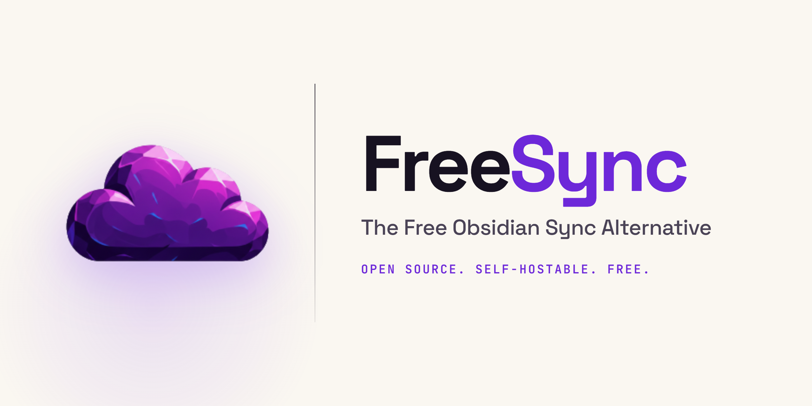

<p align="center">
  
</p>

# FreeSync

**The free, self-hostable [Obsidian](https://obsidian.md/) Sync alternative.** Real-time collaborative editing for your vault — two people (or two of your own devices) open the same note and see each other's cursors, selections, and edits as they happen. Nothing runs on our servers because there aren't any: you own the whole stack.

> **Status: pre-release, under active development.** APIs, schemas, and self-host instructions still change. Don't use with data you can't afford to lose.

---

## What you get

- **Live cursors and selections.** Every collaborator's caret appears in your editor with their name and color. Same-account cross-device shows as `You`.
- **Presence in the file explorer.** Colored bar + avatar next to the note each collaborator has open.
- **Inline comments.** CM6-anchored highlights with a right-panel thread view.
- **Live-typed remote inserts.** Brief accent pulse over ranges that arrived from collaborators — batched updates feel like typing, not "a paragraph appearing."
- **Canvas support.** Live mouse cursors on Obsidian's native canvas view, plus a schema-aware CRDT so two people dragging different nodes never corrupt the JSON.
- **Attachments sync.** Pasted images, PDFs, and other binaries land in object storage and appear on every device (rendered in the web preview too, with `![[wikilink]]` embeds resolved).
- **Web dashboard.** Browse vault contents, manage members, accept invitations without opening Obsidian.

## How the pieces fit together

```
   Obsidian plugin  ─┐          Web dashboard
   (many devices)    │          (browser)
                     │
              WebSocket + REST
                     │
              ┌──────▼──────┐
              │    Relay    │  ← self-hosted, packages/server
              │  (Node.js)  │
              └──────┬──────┘
                     │
                Auth · Postgres · Storage
                     │
              ┌──────▼──────┐
              │   Supabase  │  ← hosted or self-hosted (both open source)
              └─────────────┘
```

Plugin and web app each hold local [Yjs](https://github.com/yjs/yjs) docs. The relay merges updates from every connected client and persists them so users can rejoin later. Supabase provides auth (JWT), the metadata + Y-Doc tables, and Storage for binaries.

**A note on the database:** FreeSync is written against Supabase specifically — `supabase.auth`, `supabase.storage`, and PostgREST-shaped queries. You have two options:
- **Supabase Cloud** (free tier: 500 MB database + 1 GB storage, plenty for personal use)
- **Self-hosted Supabase** — the entire stack is open source and runs via [official Docker Compose](https://supabase.com/docs/guides/self-hosting/docker). Same APIs, same code, everything under your roof.

Swapping in raw Postgres alone (without the Supabase auth/storage services on top) would require a fork.

## Repo layout

| Package | What it does |
|---|---|
| [`packages/plugin`](packages/plugin) | Obsidian community plugin. TypeScript, esbuild. Sync via [y-websocket](https://github.com/yjs/y-websocket), presence badges, live cursors, inline comments, canvas cursors, share-vault UX. |
| [`packages/server`](packages/server) | Relay server. Node + Express + y-websocket. Terminates Yjs sync + awareness, validates JWTs against Supabase, persists Y-Doc state as BYTEA rows in `vault_docs`, generates signed Storage URLs. |
| [`packages/web`](packages/web) | Web dashboard. Next.js 15 App Router. Vault management, invitation flow, activity feed, profile settings, in-browser file browser + markdown preview. |
| [`packages/FreeSyncApp`](packages/FreeSyncApp) | Mobile app scaffold (Expo, React Native). Not shipped — feature-complete for its phase but no store rollout yet. |
| [`brain`](brain) | Design brain: Architecture, Decisions-Log, Known-Issues, Phase-Status, per-agent playbooks. Read before touching sync, presence, or persistence. |

---

# Install the plugin (via BRAT)

FreeSync isn't in Obsidian's community plugin directory yet, so installs go through [**Obsidian42 – BRAT**](https://github.com/TfTHacker/obsidian42-brat) — a small "install and auto-update from a GitHub repo" plugin that's itself in the community directory.

1. In Obsidian: **Settings → Community plugins → Browse → search "BRAT"** → install and enable.
2. **BRAT → Add beta plugin** → paste `uspeter1/freesync` → **Add plugin**.
3. **Community plugins → FreeSync → enable.**
4. **FreeSync → Advanced → Relay URL** → paste `wss://<your-relay>/sync`.

You still need a relay to point at. There's no public one yet — everyone runs their own via [Self-hosting](#self-hosting) below. BRAT will auto-check for updates whenever the manifest version bumps.

---

# Self-hosting

End-to-end setup for running your own FreeSync instance permanently. Works on any Linux host: a home server, Raspberry Pi, cheap VPS, or a spare laptop that stays on. Cost floor is **$0** (Supabase free tier + your own hardware + Cloudflare Tunnel) up to **~$5/mo** if you rent a VPS.

## What you'll need

- A machine that can stay on — Raspberry Pi 3B+ or newer, an always-on desktop, a cheap VPS (Hetzner CX22 = €3.79/mo, Vultr $2.50/mo instance), etc. **~100 MB RAM per relay is plenty** for personal use.
- **Node.js 20+** on that machine (root `package.json` enforces `engines.node: ">=20"`).
- A **Supabase project** — cloud free tier or a [self-hosted Docker install](https://supabase.com/docs/guides/self-hosting/docker). Either works.
- A **Cloudflare account** (free — for the tunnel, so you get a stable HTTPS URL without touching your router).
- A domain name (**optional but recommended**, $8–15/yr from Namecheap/Porkbun/etc — makes the URL look like `freesync.yourdomain.com` instead of `<random-id>.cfargotunnel.com`).

## Part 1 — Set up Supabase

### 1.1 Create the project

1. Sign up at [supabase.com](https://supabase.com/) → **New project** (or `docker compose up` on a self-hosted install).
2. Pick a strong DB password (store it somewhere; you won't need it often).
3. Choose the region closest to where your users live.
4. Wait ~2 minutes for provisioning.

### 1.2 Grab the keys

**Project Settings → API**:

| Key | Where it's used | Secret? |
|---|---|---|
| Project URL | Everywhere | No |
| `anon` public key | Plugin, web app | No (safe to embed in client code) |
| `service_role` key | Relay server only | **YES — never commit or ship to clients** |

### 1.3 Create the schema

**SQL Editor → New query** → paste and run:

```sql
-- ── Tables ────────────────────────────────────────────────────────────────
CREATE TABLE public.profiles (
  id            UUID PRIMARY KEY REFERENCES auth.users(id) ON DELETE CASCADE,
  display_name  TEXT NOT NULL,
  color         TEXT NOT NULL DEFAULT '#7c5cfc',
  tier          TEXT NOT NULL DEFAULT 'free',
  stripe_customer_id TEXT,
  created_at    TIMESTAMPTZ DEFAULT NOW()
);

CREATE TABLE public.vaults (
  id          UUID PRIMARY KEY DEFAULT gen_random_uuid(),
  owner_id    UUID REFERENCES auth.users(id) ON DELETE CASCADE NOT NULL,
  name        TEXT NOT NULL,
  invite_code TEXT UNIQUE NOT NULL DEFAULT encode(gen_random_bytes(6), 'hex'),
  open_invite BOOLEAN NOT NULL DEFAULT false,
  created_at  TIMESTAMPTZ DEFAULT NOW()
);

CREATE TABLE public.vault_members (
  vault_id  UUID REFERENCES public.vaults(id) ON DELETE CASCADE,
  user_id   UUID REFERENCES auth.users(id) ON DELETE CASCADE,
  status    TEXT NOT NULL DEFAULT 'active' CHECK (status IN ('active','invited')),
  joined_at TIMESTAMPTZ DEFAULT NOW(),
  PRIMARY KEY (vault_id, user_id)
);

CREATE TABLE public.vault_docs (
  id         UUID PRIMARY KEY DEFAULT gen_random_uuid(),
  vault_id   UUID REFERENCES public.vaults(id) ON DELETE CASCADE,
  file_path  TEXT NOT NULL,
  yjs_state  BYTEA,
  updated_at TIMESTAMPTZ DEFAULT NOW(),
  UNIQUE (vault_id, file_path)
);

CREATE TABLE public.pending_invites (
  id         UUID PRIMARY KEY DEFAULT gen_random_uuid(),
  vault_id   UUID NOT NULL REFERENCES public.vaults(id) ON DELETE CASCADE,
  email      TEXT NOT NULL,
  invited_at TIMESTAMPTZ NOT NULL DEFAULT NOW(),
  UNIQUE (vault_id, email)
);

-- ── Auto-create a profile row when a new auth user signs up ──────────────
CREATE OR REPLACE FUNCTION public.handle_new_user()
RETURNS TRIGGER AS $$
DECLARE
  palette TEXT[] := ARRAY['#f472b6','#60a5fa','#4ade80','#fb923c','#a78bfa','#f59e0b','#34d399'];
  user_count INT;
BEGIN
  SELECT COUNT(*) INTO user_count FROM public.profiles;
  INSERT INTO public.profiles (id, display_name, color)
  VALUES (
    NEW.id,
    COALESCE(NEW.raw_user_meta_data->>'display_name', split_part(NEW.email, '@', 1)),
    palette[(user_count % 7) + 1]
  );
  RETURN NEW;
END;
$$ LANGUAGE plpgsql SECURITY DEFINER;

CREATE TRIGGER on_auth_user_created
  AFTER INSERT ON auth.users
  FOR EACH ROW EXECUTE FUNCTION public.handle_new_user();

-- ── Auto-promote pending invites when the invitee signs up ───────────────
CREATE OR REPLACE FUNCTION public.on_invite_confirmed()
RETURNS TRIGGER AS $$
BEGIN
  IF NEW.email_confirmed_at IS NOT NULL
     AND (OLD.email_confirmed_at IS NULL OR TG_OP = 'INSERT') THEN
    INSERT INTO public.vault_members (vault_id, user_id, status)
    SELECT pi.vault_id, NEW.id, 'invited'
    FROM public.pending_invites pi
    WHERE lower(pi.email) = lower(NEW.email)
    ON CONFLICT (vault_id, user_id) DO NOTHING;

    DELETE FROM public.pending_invites WHERE lower(email) = lower(NEW.email);
  END IF;
  RETURN NEW;
END;
$$ LANGUAGE plpgsql SECURITY DEFINER;

CREATE TRIGGER on_auth_user_confirmed
  AFTER INSERT OR UPDATE OF email_confirmed_at ON auth.users
  FOR EACH ROW EXECUTE FUNCTION public.on_invite_confirmed();
```

### 1.4 Enable RLS + add policies

```sql
ALTER TABLE public.profiles        ENABLE ROW LEVEL SECURITY;
ALTER TABLE public.vaults          ENABLE ROW LEVEL SECURITY;
ALTER TABLE public.vault_members   ENABLE ROW LEVEL SECURITY;
ALTER TABLE public.vault_docs      ENABLE ROW LEVEL SECURITY;
ALTER TABLE public.pending_invites ENABLE ROW LEVEL SECURITY;

-- profiles
CREATE POLICY "profiles_select" ON public.profiles
  FOR SELECT TO authenticated USING (true);
CREATE POLICY "profiles_insert" ON public.profiles
  FOR INSERT TO authenticated WITH CHECK (auth.uid() = id);
CREATE POLICY "profiles_update" ON public.profiles
  FOR UPDATE TO authenticated USING (auth.uid() = id);

-- vaults
CREATE POLICY "vaults_owner_all" ON public.vaults
  FOR ALL TO authenticated USING (auth.uid() = owner_id);
CREATE POLICY "vaults_member_select" ON public.vaults
  FOR SELECT TO authenticated USING (
    EXISTS (
      SELECT 1 FROM public.vault_members
      WHERE vault_id = id AND user_id = auth.uid() AND status = 'active'
    )
  );

-- vault_members
CREATE POLICY "vault_members_owner_all" ON public.vault_members
  FOR ALL TO authenticated USING (
    EXISTS (SELECT 1 FROM public.vaults WHERE id = vault_id AND owner_id = auth.uid())
  );
CREATE POLICY "vault_members_self_select" ON public.vault_members
  FOR SELECT TO authenticated USING (auth.uid() = user_id);
CREATE POLICY "vault_members_self_insert" ON public.vault_members
  FOR INSERT TO authenticated WITH CHECK (auth.uid() = user_id);

-- vault_docs (relay uses service_role and bypasses this; kept for direct DB reads)
CREATE POLICY "vault_docs_member_all" ON public.vault_docs
  FOR ALL TO authenticated USING (
    EXISTS (
      SELECT 1 FROM public.vault_members
      WHERE vault_id = vault_docs.vault_id AND user_id = auth.uid() AND status = 'active'
    )
  );

-- pending_invites (owner-managed)
CREATE POLICY "pending_invites_owner_all" ON public.pending_invites
  FOR ALL TO authenticated USING (
    EXISTS (SELECT 1 FROM public.vaults WHERE id = vault_id AND owner_id = auth.uid())
  );
```

### 1.5 Create the Storage bucket for binaries

Images, PDFs and other non-text attachments live in **Supabase Storage**, not in `vault_docs`.

1. **Storage → New bucket** → name `vault-assets` → **Public bucket: ON** → **Create**. Public lets browsers fetch attachments by signed URL without a round-trip through the relay.

2. In **SQL Editor**, run these policies (they gate uploads/updates/deletes to active vault members via a SECURITY DEFINER helper — Supabase Storage's schema pre-check rejects cross-schema `EXISTS` subqueries inside RLS policies):

```sql
CREATE OR REPLACE FUNCTION public.is_active_vault_member(vault_id_text text, uid uuid)
RETURNS boolean
LANGUAGE sql SECURITY DEFINER STABLE
SET search_path = public
AS $$
  SELECT EXISTS (
    SELECT 1 FROM public.vault_members
    WHERE vault_id::text = vault_id_text
      AND user_id = uid
      AND status = 'active'
  );
$$;
GRANT EXECUTE ON FUNCTION public.is_active_vault_member(text, uuid) TO anon, authenticated;

CREATE POLICY "buckets_select_authenticated"
  ON storage.buckets FOR SELECT TO authenticated USING (true);

CREATE POLICY "vault_assets_insert_active_members"
  ON storage.objects FOR INSERT TO authenticated
  WITH CHECK (
    bucket_id = 'vault-assets'
    AND public.is_active_vault_member((storage.foldername(name))[1], auth.uid())
  );

CREATE POLICY "vault_assets_update_active_members"
  ON storage.objects FOR UPDATE TO authenticated
  USING (
    bucket_id = 'vault-assets'
    AND public.is_active_vault_member((storage.foldername(name))[1], auth.uid())
  )
  WITH CHECK (
    bucket_id = 'vault-assets'
    AND public.is_active_vault_member((storage.foldername(name))[1], auth.uid())
  );

CREATE POLICY "vault_assets_delete_active_members"
  ON storage.objects FOR DELETE TO authenticated
  USING (
    bucket_id = 'vault-assets'
    AND public.is_active_vault_member((storage.foldername(name))[1], auth.uid())
  );
```

### 1.6 Auth settings

**Authentication → Providers → Email**:
- Confirm email: **your call**. Off = users sign in immediately after signup (fine for personal use). On = production behavior (users must click a link — requires SMTP).
- JWT expiry: 3600s default is fine.

## Part 2 — Run the relay server

The relay is a Node.js process that terminates WebSocket connections from clients and merges Yjs edits into a shared document, persisting to Supabase.

### 2.1 Install Node.js

**On Debian/Ubuntu/Raspberry Pi OS:**
```bash
curl -fsSL https://deb.nodesource.com/setup_20.x | sudo bash -
sudo apt install -y nodejs git
node --version   # should be v20+
```

**On any other Linux distro** — install Node 20+ however you normally would (nvm, `apk add nodejs npm`, etc).

> **Raspberry Pi note:** Pi 3B+ / 4 / 5 / Zero 2W all work (arm64). Pi Zero W (armv6) — the Node ecosystem's arm64 assumption makes this painful; use a newer Pi.

### 2.2 Get the code onto the host

```bash
cd /opt   # or wherever you keep services
sudo git clone https://github.com/uspeter1/freesync.git
sudo chown -R $USER:$USER freesync
cd freesync
npm install
```

### 2.3 Configure the relay

```bash
cp packages/server/.env.example packages/server/.env
$EDITOR packages/server/.env
```

Fill in:

```dotenv
SUPABASE_URL=https://<your-project-ref>.supabase.co
SUPABASE_SERVICE_ROLE_KEY=<paste from Supabase Settings → API>

# Web origins allowed to talk to the relay (CORS).
# Comma-separated. Include EVERY URL where the web app is hosted, plus
# localhost for local dev.
ALLOWED_ORIGINS=https://freesync-web.yourdomain.com,http://localhost:3002

PORT=3001
```

### 2.4 Test-run

```bash
npm run dev --workspace=packages/server
```

Confirm from another shell:
```bash
curl http://localhost:3001/health
# {"status":"ok","ts":"..."}
```

If that works, Ctrl+C and set it up to run permanently.

### 2.5 Run as a systemd service

Create `/etc/systemd/system/freesync-relay.service`:

```ini
[Unit]
Description=FreeSync relay server
After=network.target

[Service]
Type=simple
User=<your-username>
WorkingDirectory=/opt/freesync
ExecStart=/usr/bin/npx tsx packages/server/src/index.ts
Restart=always
RestartSec=5
Environment=NODE_ENV=production
StandardOutput=journal
StandardError=journal

[Install]
WantedBy=multi-user.target
```

Then:
```bash
sudo systemctl daemon-reload
sudo systemctl enable --now freesync-relay
sudo systemctl status freesync-relay
journalctl -u freesync-relay -f     # tail logs
```

## Part 3 — Expose the relay to the internet

The plugin connects over WSS (WebSocket-over-TLS). You need a publicly reachable URL that terminates TLS.

### Option A — Cloudflare Tunnel (recommended)

**Pros:** No port-forwarding, no cert renewal, free forever, works behind CGNAT/NAT.
**Cons:** Traffic goes through Cloudflare's edge (fine for personal use — latency added is ~20–50 ms).

1. Sign in at [cloudflare.com](https://cloudflare.com), add your domain. Change the domain's nameservers to the two Cloudflare gives you.

2. On your relay host:
```bash
# Install cloudflared
curl -L https://github.com/cloudflare/cloudflared/releases/latest/download/cloudflared-linux-arm64.deb -o /tmp/cloudflared.deb
sudo dpkg -i /tmp/cloudflared.deb   # use ...-amd64.deb on x86 hosts

cloudflared tunnel login
cloudflared tunnel create freesync
cloudflared tunnel route dns freesync freesync.yourdomain.com

mkdir -p ~/.cloudflared
cat > ~/.cloudflared/config.yml <<'YAML'
tunnel: freesync
credentials-file: /home/YOUR_USER/.cloudflared/<tunnel-id>.json
ingress:
  - hostname: freesync.yourdomain.com
    service: http://localhost:3001
  - service: http_status:404
YAML

cloudflared tunnel run freesync
```

Test: `curl https://freesync.yourdomain.com/health` should match `curl localhost:3001/health`.

3. Install as a service so it survives reboots:
```bash
sudo cloudflared service install
sudo systemctl start cloudflared
sudo systemctl enable cloudflared
```

Your relay URL is now `wss://freesync.yourdomain.com/sync`.

> **No domain?** Cloudflare Tunnel "quick tunnels" give you a random `<id>.trycloudflare.com` URL, but **they rotate on every restart** — not suitable for permanent use. Cheapest fix: an $8/yr `.xyz` at Porkbun.

### Option B — Direct port-forward + Caddy + Let's Encrypt

Alternative if you don't want Cloudflare in the path. Forward ports 80/443 to the relay host, point a DNS A record at your public IP, install Caddy:

`/etc/caddy/Caddyfile`:
```
freesync.yourdomain.com {
    reverse_proxy 127.0.0.1:3001
}
```

`sudo systemctl restart caddy`. Caddy handles cert acquisition + renewal automatically.

## Part 4 — Web dashboard (optional)

Skip this section if you're happy managing invitations from inside the plugin.

### Option A — Deploy to Vercel (easiest)

1. Fork the repo (or push your own copy)
2. Import the project into Vercel
3. Set **Root Directory** to `packages/web`
4. Environment variables:
   - `NEXT_PUBLIC_SUPABASE_URL`
   - `NEXT_PUBLIC_SUPABASE_ANON_KEY`
   - `NEXT_PUBLIC_RELAY_URL` — `https://freesync.yourdomain.com` (no path, no `wss://`)
5. Deploy.
6. **Back in the relay's `.env`**: add the web URL to `ALLOWED_ORIGINS`, then restart the relay:
   ```bash
   sudo systemctl restart freesync-relay
   ```

### Option B — Run on the same host as the relay

```bash
cd /opt/freesync
cp packages/web/.env.example packages/web/.env.local
# Same three env vars as above
npm run build --workspace=packages/web
```

Then a systemd unit similar to the relay's, running `npm start --workspace=packages/web` on port 3002.

## Part 5 — Build and install the plugin

```bash
git clone https://github.com/uspeter1/freesync.git   # or use your existing checkout
cd freesync
npm install

cp packages/plugin/.env.example packages/plugin/.env
$EDITOR packages/plugin/.env
```

`packages/plugin/.env`:
```dotenv
RELAY_URL=wss://freesync.yourdomain.com/sync
WEB_APP_URL=https://freesync-web.yourdomain.com   # or your Vercel URL, or leave default
```

```bash
npm run build --workspace=packages/plugin
```

This produces `packages/plugin/main.js`, `manifest.json`, `styles.css`.

### Install into Obsidian

**Manual copy** (one vault):
```
<your-vault>/.obsidian/plugins/freesync/
  main.js
  manifest.json
  styles.css
```
Then in Obsidian: **Settings → Community plugins → Enable community plugins → Enable FreeSync**.

**Auto-update via BRAT** (multiple devices):
Publish a GitHub release with the three files as assets. On each device:
1. Install **Obsidian42 - BRAT** from community plugins
2. **BRAT → Add beta plugin** → `<your-github-user>/freesync`
3. Enable FreeSync

BRAT will auto-check for updates when you bump the manifest version.

## Part 6 — End-to-end sanity check

1. Sign in on **two devices** with the same account.
2. Both should show as connected in **FreeSync sidebar** (users icon in ribbon).
3. Open the same note in both. Type on one — text should appear on the other within a second, with a brief accent pulse.
4. Move your cursor on one — should show as a colored caret + name label on the other.
5. Paste an image on one — should upload, sync, and render inline on the other.

## Tips

- **Back up your Supabase database periodically.** The free tier keeps daily backups for 7 days. For deeper history, `pg_dump` on cron to storage you own.
- **Watch relay memory.** `journalctl -u freesync-relay -f`. Each open vault keeps its Y-Docs in RAM. Restarting the relay is safe — clients reconnect automatically.
- **Rotate the invite code** on the web dashboard if a code leaks.
- **Test with throwaway accounts.** Gmail's `+alias` trick: `you+freesync-test@gmail.com` land in `you@gmail.com` but Supabase treats them as separate users.

## Troubleshooting

**Plugin says "connected" but nothing syncs.**  Check the relay is reachable: `curl https://freesync.yourdomain.com/health` from your device's network. Watch relay logs (`journalctl -u freesync-relay -f`) while opening a note — you should see WebSocket connections show up.

**"Failed to fetch" in the web dashboard.**  The web tunnel's origin isn't in `ALLOWED_ORIGINS`. Add it to `packages/server/.env` and restart the relay. Rejected CORS requests log as `[error] CORS: origin ... not allowed`.

**Images fail to upload with "The database schema is invalid or incompatible".**  Missing `SELECT` policy on `storage.buckets`. Re-run the SQL in [Part 1.5](#15-create-the-storage-bucket-for-binaries).

**Images fail to upload with "new row violates row-level security policy".**  Missing / incorrect INSERT policy on `storage.objects` — the helper-function form in Part 1.5 is required. Or you're signed in as a user who isn't an **active** member of that vault.

**Storage uploads worked at first, then start 401ing after an hour.**  Old bug we already fixed on the plugin side (JWT expired, no auto-refresh). Make sure your plugin build is ≥ 0.2.1.

**Cloudflare Tunnel URL rotates on restart.**  You're using the ephemeral quick-tunnel form. Switch to the **named** tunnel setup in Part 3.

---

# Local development

For hacking on the code (as opposed to running for real), the commands are the same but you run everything on `localhost`:

```bash
# Relay (:3001)
cp packages/server/.env.example packages/server/.env
# Fill SUPABASE_URL, SUPABASE_SERVICE_ROLE_KEY, ALLOWED_ORIGINS
npm install
npm run dev --workspace=packages/server

# Web dashboard (:3002)  — in another shell
cp packages/web/.env.example packages/web/.env.local
# Fill NEXT_PUBLIC_SUPABASE_URL, NEXT_PUBLIC_SUPABASE_ANON_KEY, NEXT_PUBLIC_RELAY_URL
npm run dev --workspace=packages/web

# Plugin — one-off build, or --watch during active dev
cp packages/plugin/.env.example packages/plugin/.env
npm run build --workspace=packages/plugin
```

The plugin's built `main.js`, `manifest.json`, and `styles.css` land in `packages/plugin/`. Drop them into `<your-vault>/.obsidian/plugins/freesync/` and enable in Obsidian.

Multi-vault dev loop: set `FREESYNC_DEV_VAULTS` (colon-separated plugin dirs) and the build copies to all of them:

```bash
export FREESYNC_DEV_VAULTS=/path/to/vault1/.obsidian/plugins/freesync:/path/to/vault2/.obsidian/plugins/freesync
```

The plugin's **Advanced** settings panel exposes runtime overrides for Supabase URL, anon key, relay URL, and web-app URL — useful for repointing a running plugin at a different backend without a rebuild.

## Design decisions and known issues

**Read [`brain/Decisions-Log.md`](brain/Decisions-Log.md) and [`brain/Known-Issues.md`](brain/Known-Issues.md) before touching sync, presence, or the relay's persistence layer.** Several past regressions caused real data loss; the fixes are load-bearing. Highlights:

- Relay persistence uses `setPersistence({ bindState, writeState })`. The "cross-restart" case is a real prior data-loss root cause — never remove `bindState`.
- The Supabase client is created with `{ persistSession: false, autoRefreshToken: true }`. `persistSession: false` prevents Electron vault windows from sharing sessions via localStorage; `autoRefreshToken: true` keeps the JWT alive past 1 hour so Storage uploads don't silently 401.
- Cursor presence relies on specific CSS (`box-shadow` not `border-left`) and a CM6 `awarenessCleaner` guard pattern. See [`CLAUDE.md`](CLAUDE.md).
- Receiver-side deletes always go through `vault.trash`, never `vault.delete` — the last-resort recovery net.
- Storage upload path uses direct `fetch`, not `supabase-js`'s Storage client, and puts `upsert=true` in the query string rather than the `x-upsert` header. Both worked around real bugs (see [Troubleshooting](#troubleshooting)).

## Roadmap

Phase status and priorities live in [`brain/Phase-Status.md`](brain/Phase-Status.md). Near-term focus:

- Hosted relay for people who don't want to self-host
- Publish to Obsidian's community plugin directory
- Mobile app rollout
- `supabase/migrations/` folder so schema deltas ship with the repo

## License

[MIT](LICENSE) © 2026 Peter J.

## Contributing

Pull requests are welcome — anyone can open one, I'll review and merge. Bug reports, feature ideas, docs fixes, and tests are all fair game. See [CONTRIBUTING.md](CONTRIBUTING.md) for the details.
